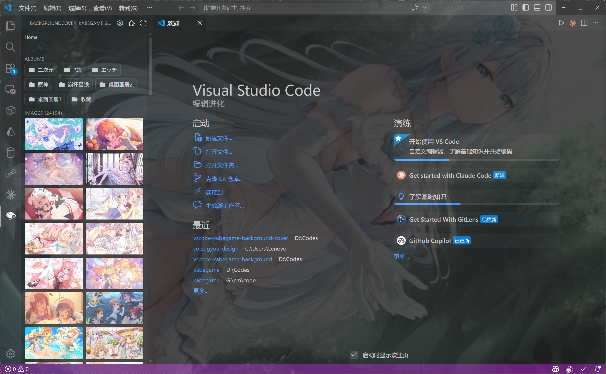

<h1 align="center">
     
    VS Code - Kabegame Background Cover
</h1>

    <b>让你喜欢的图片或视频铺满 VS Code，或者直接连接壁龟同步背景设置（同步壁龟一起轮播呀）</b> 
    

---

## 🌟 功能特性

- **图片/视频背景**：支持本地图片、网络图片、本地视频、在线视频。
- **跟随kabegame**：可以和kabegame同步背景设置，预览壁龟画廊和画册，这下好了，再也不用为了看一张好看的壁纸在编辑器和桌面间跳来跳去了。
- **可视化配置**：左侧面板一键设置，支持中英双语。
- **透明度/模糊/填充模式**：自定义背景透明度、模糊度、填充方式。
- **跨平台支持**：兼容 Windows、MacOS、Linux 及 Code-Server。
- **自动权限处理**：Windows 下自动获取写入权限，无需手动操作。

## 预览

## ⚠️ 注意事项

> 本插件通过修改 VS Code 内部文件实现效果。

1. **首次使用/升级 3.1.0**：需重新获取权限（Hook），并重启一次 VS Code。
2. **初次安装/更新**：如遇“安装损坏”提示，请点击【不再提示】。
3. **背景重叠/异常**：升级后如遇背景重叠，请重启 VS Code。
4. **还原方法**：如 VS Code 无法打开，请手动还原：
   - 路径：`Microsoft VS Code\resources\app\out\vs\workbench\`
   - 将 `workbench.desktop.main.js.bak` 重命名为 `workbench.desktop.main.js`

---

### 致谢

- [vscode-background-cover](https://github.com/AShujiao/vscode-background-cover)

## 📄 许可证
本项目采用 [MIT 许可证](LICENSE) 进行许可。

## 仓库
- [Kabegame](https://github.com/kabegame/kabegame)
- [本拡張子](https://github.com/kabegame/vscode-kabegame-vscode-background-cover)
